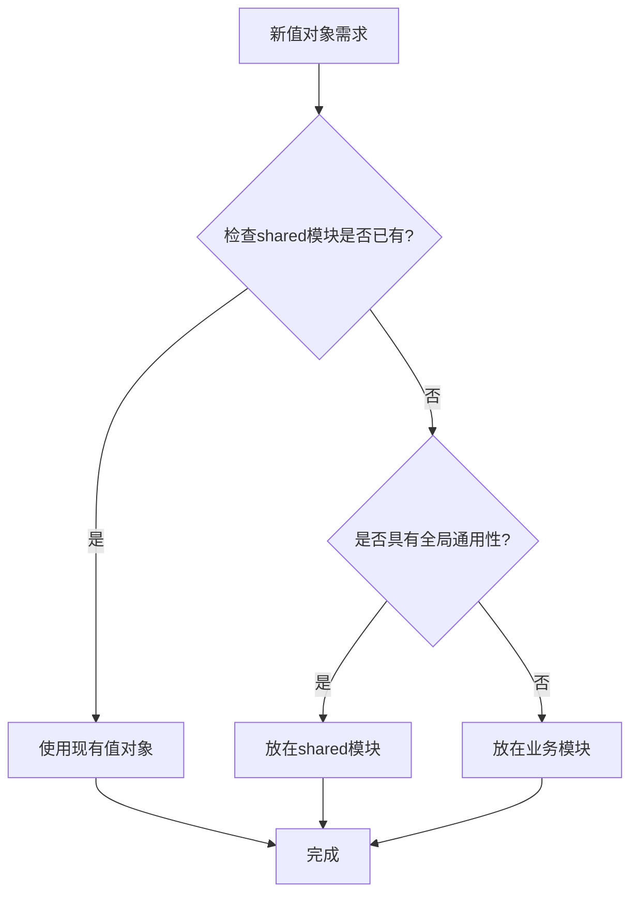

# 🏗️ 多租户SaaS平台开发范式指南

## 📋 文档信息

- **文档版本**: v1.0.0
- **创建日期**: 2024-12-19
- **最后更新**: 2024-12-19
- **文档状态**: 正式版
- **适用对象**: 开发团队、AI助手
- **适用范围**: 多租户SaaS平台所有模块开发

## 🎯 文档目的

本文档基于用户模块的完整实现，总结出多租户SaaS平台的标准化开发范式，为其他模块（租户、组织、部门、权限等）的开发提供清晰的指导，确保整个系统的一致性和可维护性。

## 📊 实现状态说明

### **已完成部分** ✅

- **领域层**: 实体、聚合根、仓储接口、领域事件
- **基础设施层**: PostgreSQL实体、MongoDB实体、仓储实现、映射器
- **事件投影机制**: 完整的事件处理和同步机制

### **开发中部分** 🔄

- **应用层**: 应用服务、Use Case、接口和DTO
- **表现层**: 控制器、守卫、拦截器、验证器

### **待开发部分** ⏳

- **租户模块**: 完整的租户管理功能
- **组织模块**: 组织架构管理
- **部门模块**: 部门管理
- **权限系统**: RBAC/ABAC实现

## 🏛️ 整体架构模式

### 1. **分层架构 (Clean Architecture)**

```
┌─────────────────────────────────────────────────────────────┐
│                    Presentation Layer                       │
│                    (表示层 - 控制器、守卫、拦截器)            │
├─────────────────────────────────────────────────────────────┤
│                    Application Layer                        │
│                    (应用层 - 服务、用例、接口)               │
├─────────────────────────────────────────────────────────────┤
│                     Domain Layer                            │
│                    (领域层 - 实体、聚合根、仓储)             │
├─────────────────────────────────────────────────────────────┤
│                  Infrastructure Layer                       │
│                    (基础设施层 - 实现、映射、配置)            │
└─────────────────────────────────────────────────────────────┘
```

### 2. **CQRS + Event Sourcing 模式**

- **Command Side**: 命令处理，写操作，状态变更，使用PostgreSQL + MikroORM
- **Query Side**: 查询处理，读操作，数据检索，使用MongoDB + MikroORM（支持复杂查询和聚合）
- **Event Sourcing**: 事件溯源，状态重建，审计追踪

### 3. **多租户数据隔离架构**

- **平台级**: 全局共享数据
- **租户级**: 租户内共享数据
- **组织级**: 组织内共享数据
- **部门级**: 部门内共享数据
- **用户级**: 用户私有数据

## 📁 标准文件结构

```
src/
├── domain/                    # 领域层
│   ├── entities/             # 领域实体
│   ├── aggregates/           # 聚合根
│   ├── repositories/         # 仓储接口
│   ├── domain-events/       # 领域事件
│   ├── enums/               # 枚举定义
│   ├── value-objects/       # 值对象
│   ├── services/            # 领域服务
│   ├── exceptions/          # 领域异常
│   └── types/               # 类型定义
├── application/              # 应用层
│   ├── services/            # 应用服务
│   ├── use-cases/           # 用例
│   ├── interfaces/          # 接口定义
│   ├── dtos/               # 数据传输对象
│   ├── projections/         # 查询投影
│   ├── commands/            # 命令
│   └── queries/             # 查询
├── infrastructure/           # 基础设施层
│   ├── repositories/        # 仓储实现
│   ├── mappers/            # 映射器
│   ├── entities/            # 持久化实体
│   ├── config/             # 配置
│   ├── migrations/          # 数据库迁移
│   ├── events/             # 事件处理
│   └── external/            # 外部服务集成
└── presentation/             # 表示层
    ├── controllers/         # 控制器
    ├── guards/             # 守卫
    ├── interceptors/       # 拦截器
    ├── validators/         # 验证器
    └── dtos/               # 请求/响应DTO
```

## 🔧 技术栈规范

### **核心框架**

- **NestJS**: 应用框架
- **TypeScript**: 开发语言
- **Clean Architecture**: 架构模式
- **CQRS**: 命令查询职责分离
- **Event Sourcing**: 事件溯源

### **数据库支持**

- **PostgreSQL**: 关系型数据库，使用MikroORM（命令端，写操作）
- **MongoDB**: 文档型数据库，使用MikroORM的MongoDB驱动（查询端，读操作）
- **Redis**: 缓存和会话管理

**注意**: 虽然使用两种不同的数据库，但都通过MikroORM统一管理，确保代码的一致性和可维护性。

**当前实现状态**:

- PostgreSQL实体使用 `@Entity({ tableName: 'table_name' })`
- MongoDB实体使用 `@Entity({ collection: 'collection_name' })`
- 所有数据库操作都通过MikroORM的EntityManager进行

### **日志和监控**

- **Pino**: 日志服务
- **PinoLoggerService**: 自定义日志服务

### **包管理**

- **pnpm**: 包管理器
- **Monorepo**: 单仓库多包管理

### **值对象开发策略**

- **优先使用shared模块**: 优先使用shared模块中已有的值对象，避免重复实现
- **全局通用性判断**: 创建新值对象时，优先考虑是否具有全局通用性
- **模块化设计**: 业务特定的值对象放在对应模块，全局通用的值对象放在shared模块
- **一致性保证**: 确保相同功能的值对象在整个系统中保持一致

## 📝 命名规范

### **类命名**

- **实体**: `EntityName` (如: `UserEntity`, `TenantEntity`)
- **聚合根**: `EntityAggregate` (如: `UserAggregate`, `TenantAggregate`)
- **仓储**: `EntityRepository` (如: `UserRepository`, `TenantRepository`)
- **服务**: `EntityManagementService` (如: `UserManagementService`)
- **控制器**: `EntityManagementController` (如: `UserManagementController`)
- **事件**: `EntityActionEvent` (如: `UserCreatedEvent`)

### **文件命名**

- **实体**: `entity-name.entity.ts`
- **聚合根**: `entity-name.aggregate.ts`
- **仓储**: `entity-name.repository.ts`
- **服务**: `entity-name-management.service.ts`
- **控制器**: `entity-name-management.controller.ts`
- **事件**: `entity-action.event.ts`

### **变量命名**

- **私有属性**: `_propertyName` (下划线前缀)
- **公共属性**: `propertyName` (驼峰命名)
- **常量**: `CONSTANT_NAME` (全大写)
- **枚举**: `EnumName` (帕斯卡命名)

---

## 🎯 领域层开发规范

### **0. 值对象 (Value Objects) 开发规范**

#### **值对象分类原则**

**全局通用值对象 (放在 shared 模块)**:

- **跨领域使用**: 所有需要该值对象的模块都需要
- **标准化规则**: 值对象格式、长度、唯一性等规则相对统一
- **无业务依赖**: 不依赖特定业务逻辑，纯粹的数据验证
- **频繁复用**: 在多个子领域中被大量使用

**模块特有值对象 (放在对应模块)**:

- **业务特定**: 只在特定业务模块中使用
- **业务依赖**: 依赖特定业务逻辑和规则
- **局部使用**: 使用范围有限，不需要跨模块共享

#### **值对象开发优先级**

1. **优先使用 shared 模块的值对象**
   - 检查是否已有相同或相似的值对象
   - 避免重复实现相同的功能
   - 确保整个系统的一致性

2. **创建新值对象时的考虑因素**
   - 是否具有全局通用性？
   - 是否会被多个模块使用？
   - 是否遵循标准化的规则？
   - 是否不依赖特定业务逻辑？

3. **值对象放置决策树**
   ```
   新值对象需求
   ├── 检查shared模块是否已有 → 使用现有值对象
   ├── 具有全局通用性 → 放在shared模块
   └── 业务特定 → 放在对应模块
   ```

#### **值对象开发示例**

**全局通用值对象示例** (shared模块):

```typescript
// 租户名称 - 全局通用
export class TenantName extends BaseValueObject {
  // 所有模块都需要租户名称验证
  // 验证规则相对统一
  // 不依赖特定业务逻辑
}

// 租户代码 - 全局通用
export class TenantCode extends BaseValueObject {
  // 所有模块都需要租户代码
  // 代码生成规则统一
  // 格式验证标准一致
}

// 租户域名 - 全局通用
export class TenantDomain extends BaseValueObject {
  // 所有模块都需要域名验证
  // 遵循RFC标准
  // 支持子域名管理
}
```

**业务特定值对象示例** (tenant模块):

```typescript
// 租户类型 - 业务特定
export enum TenantType {
  ENTERPRISE = 'enterprise',
  SMB = 'smb',
  PERSONAL = 'personal',
  // 只在租户模块中使用
  // 依赖租户业务逻辑
  // 包含业务特定的配置信息
}
```

### **1. 实体 (Entity) 开发规范**

#### **基本结构**

````typescript
/**
 * @class EntityName
 * @description 实体描述
 *
 * 原理与机制：
 * 1. 继承DataIsolationAwareEntity，支持多层级数据隔离
 * 2. 使用值对象封装复杂属性
 * 3. 实现业务规则和验证逻辑
 * 4. 提供领域事件发布能力
 *
 * 功能与职责：
 * 1. 表达核心业务属性和行为
 * 2. 封装业务规则
 * 3. 保证实体一致性和完整性
 * 4. 支持数据隔离和访问控制
 *
 * @example
 * ```typescript
 * const entity = new EntityName(
 *   'entity-123',
 *   'name',
 *   'tenant-456'
 * );
 * entity.performAction();
 * ```
 * @since 1.0.0
 */
export class EntityName extends DataIsolationAwareEntity {
  // 私有属性，通过getter访问
  private readonly _id: EntityId;
  private _status: EntityStatus;
  private _name: string;

  // 构造函数
  constructor(
    id: EntityId,
    name: string,
    tenantId: TenantId,
    organizationId?: TenantId,
    departmentIds: TenantId[] = [],
    status: EntityStatus = EntityStatus.ACTIVE,
    dataPrivacyLevel: DataPrivacyLevel = DataPrivacyLevel.PROTECTED,
  ) {
    super(
      tenantId,
      DataIsolationLevel.ORGANIZATION, // 根据业务需求设置
      dataPrivacyLevel,
      id,
      organizationId,
      departmentIds,
    );

    this._id = id;
    this._name = name;
    this._status = status;
  }

  // 静态工厂方法
  static create(
    id: EntityId,
    name: string,
    tenantId: TenantId,
    organizationId?: TenantId,
    departmentIds: TenantId[] = [],
  ): EntityName {
    return new EntityName(id, name, tenantId, organizationId, departmentIds);
  }

  // 业务方法
  public performAction(): void {
    if (this._status !== EntityStatus.ACTIVE) {
      throw new Error('实体必须处于激活状态才能执行操作');
    }

    // 业务逻辑实现
    this._status = EntityStatus.PROCESSING;
  }

  public changeStatus(newStatus: EntityStatus): void {
    if (this._status === newStatus) {
      return; // 如果状态没有变化，直接返回
    }

    // 状态变更验证逻辑
    this._status = newStatus;
  }

  // Getter方法
  public get id(): EntityId {
    return this._id;
  }
  public get name(): string {
    return this._name;
  }
  public get status(): EntityStatus {
    return this._status;
  }
  public get isActive(): boolean {
    return this._status === EntityStatus.ACTIVE;
  }
}
````

#### **关键要点**

- **继承关系**: 必须继承 `DataIsolationAwareEntity`
- **属性封装**: 所有属性都是私有的，通过getter访问
- **业务验证**: 在业务方法中实现验证逻辑
- **状态管理**: 提供状态查询和变更方法
- **工厂方法**: 提供静态工厂方法简化创建

### **2. 聚合根 (Aggregate Root) 开发规范**

#### **基本结构**

````typescript
/**
 * @class EntityAggregate
 * @description 聚合根描述
 *
 * 原理与机制：
 * 1. 继承AggregateRoot，管理一致性边界
 * 2. 封装业务规则和验证逻辑
 * 3. 使用事件管理功能
 * 4. 确保数据完整性和一致性
 *
 * 功能与职责：
 * 1. 管理实体的生命周期
 * 2. 执行相关的业务规则
 * 3. 发布领域事件
 * 4. 维护数据的一致性
 *
 * @example
 * ```typescript
 * const aggregate = EntityAggregate.create(
 *   'entity-123',
 *   'name',
 *   'tenant-456'
 * );
 * aggregate.performAction();
 * ```
 * @since 1.0.0
 */
export class EntityAggregate extends AggregateRoot<string> {
  private _entity!: EntityName;
  private _relatedEntities: RelatedEntity[] = [];

  constructor(id: string) {
    super(id);
    // 聚合根构造函数，用于事件溯源重建
  }

  // 静态工厂方法
  static create(
    id: EntityId,
    name: string,
    tenantId: TenantId,
    organizationId?: TenantId,
    departmentIds: TenantId[] = [],
  ): EntityAggregate {
    const aggregate = new EntityAggregate(id.toString());

    // 创建实体
    aggregate._entity = EntityName.create(
      id,
      name,
      tenantId,
      organizationId,
      departmentIds,
    );

    // 应用创建事件
    aggregate.addDomainEvent(
      new EntityCreatedEvent(
        id.toString(),
        name,
        tenantId.toString(),
        organizationId?.toString(),
        departmentIds.map(deptId => deptId.toString()),
      ),
    );

    return aggregate;
  }

  // 业务方法
  public performAction(): void {
    // 业务规则验证
    if (!this._entity.isActive) {
      throw new Error('实体必须处于激活状态');
    }

    // 执行业务逻辑
    this._entity.performAction();

    // 发布事件
    this.addDomainEvent(
      new EntityActionEvent(this._entity.id.toString(), 'ACTION_PERFORMED'),
    );
  }

  // Getter方法
  public get entity(): EntityName {
    return this._entity;
  }
  public get relatedEntities(): RelatedEntity[] {
    return [...this._relatedEntities];
  }
}
````

#### **关键要点**

- **事件管理**: 使用 `addDomainEvent` 发布领域事件
- **业务协调**: 协调多个实体和值对象
- **一致性保证**: 确保聚合内数据的一致性
- **状态查询**: 提供聚合状态的查询方法

### **3. 仓储接口 (Repository Interface) 开发规范**

#### **基本结构**

````typescript
/**
 * @interface EntityRepository
 * @description 仓储接口描述
 *
 * 功能与职责：
 * 1. 实体的增删改查操作
 * 2. 支持多租户数据隔离
 * 3. 提供复杂查询和过滤功能
 * 4. 支持批量操作
 *
 * @example
 * ```typescript
 * class PostgresEntityRepository implements EntityRepository {
 *   async findById(id: EntityId): Promise<EntityName | null> {
 *     // 实现查找逻辑
 *   }
 * }
 * ```
 * @since 1.0.0
 */
export interface EntityRepository {
  // 基本CRUD操作
  findById(id: EntityId): Promise<EntityName | null>;
  save(entity: EntityName): Promise<void>;
  delete(id: EntityId): Promise<void>;

  // 查询操作
  findByCriteria(criteria: EntityQueryCriteria): Promise<EntityName[]>;
  findByTenantId(tenantId: TenantId): Promise<EntityName[]>;
  findByOrganizationId(organizationId: TenantId): Promise<EntityName[]>;

  // 批量操作
  saveMany(entities: EntityName[]): Promise<void>;
  deleteMany(ids: EntityId[]): Promise<void>;

  // 统计操作
  countByTenantId(tenantId: TenantId): Promise<number>;
  countByCriteria(criteria: EntityQueryCriteria): Promise<number>;
}

// 查询条件接口
export interface EntityQueryCriteria {
  tenantId?: TenantId;
  organizationId?: TenantId;
  departmentIds?: TenantId[];
  status?: EntityStatus;
  name?: string;
  createdAfter?: Date;
  createdBefore?: Date;
  limit?: number;
  offset?: number;
}
````

#### **关键要点**

- **接口定义**: 只定义方法签名，不包含实现
- **查询条件**: 定义标准的查询条件接口
- **多租户支持**: 所有查询方法都要支持租户隔离
- **批量操作**: 提供批量操作支持
- **统计功能**: 提供统计和计数功能

### **4. 领域事件 (Domain Events) 开发规范**

#### **基本结构**

````typescript
/**
 * @class EntityActionEvent
 * @description 领域事件描述
 *
 * 原理与机制：
 * 1. 继承DomainEvent基类
 * 2. 包含事件的关键数据
 * 3. 支持事件溯源和审计
 * 4. 可以被其他模块订阅
 *
 * 功能与职责：
 * 1. 记录领域事件
 * 2. 传递关键信息
 * 3. 支持事件溯源和状态重建
 * 4. 触发相关的业务流程
 *
 * @example
 * ```typescript
 * const event = new EntityActionEvent(
 *   'entity-123',
 *   'ACTION_PERFORMED',
 *   { actionType: 'CREATE', userId: 'user-456' }
 * );
 * ```
 * @since 1.0.0
 */
export class EntityActionEvent extends DomainEvent {
  public readonly eventType = 'EntityAction';
  public readonly eventVersion = '1.0.0';
  public readonly aggregateId: string;
  public readonly aggregateType = 'Entity';
  public readonly version = 1;

  constructor(
    public readonly entityId: string,
    public readonly action: string,
    public readonly metadata?: Record<string, any>,
    public readonly timestamp: Date = new Date(),
  ) {
    super('EntityAction', {
      entityId,
      action,
      metadata,
      timestamp,
    });
    this.aggregateId = entityId;
  }

  // 获取事件数据
  public getEventData(): EntityActionEventData {
    return {
      entityId: this.entityId,
      action: this.action,
      metadata: this.metadata,
      timestamp: this.timestamp,
    };
  }
}

// 事件数据接口
export interface EntityActionEventData {
  entityId: string;
  action: string;
  metadata?: Record<string, any>;
  timestamp: Date;
}
````

#### **关键要点**

- **事件类型**: 定义明确的事件类型和版本
- **聚合信息**: 包含聚合ID和类型信息
- **时间戳**: 记录事件发生的时间
- **元数据**: 支持额外的业务数据
- **序列化**: 支持事件的序列化和反序列化

---

## 🚀 应用层开发规范

### **1. 应用服务 (Application Service) 开发规范**

#### **基本结构**

````typescript
/**
 * @class EntityManagementService
 * @description 应用服务描述
 *
 * 原理与机制：
 * 1. 作为应用层的协调服务，只负责简单业务协调
 * 2. 复杂业务逻辑交给专门的业务服务处理
 * 3. 通过依赖注入使用Use Case和业务服务
 * 4. 提供统一的错误处理和日志记录
 *
 * 功能与职责：
 * 1. 简单的业务操作协调
 * 2. 调用相应的Use Case处理具体业务逻辑
 * 3. 提供统一的错误处理和日志记录
 * 4. 不处理复杂的跨模块业务逻辑
 *
 * @example
 * ```typescript
 * const service = new EntityManagementService(
 *   createEntityUseCase,
 *   updateEntityUseCase,
 *   getEntityUseCase,
 *   eventBus,
 *   logger
 * );
 *
 * const result = await service.createEntity(createRequest);
 * ```
 * @since 1.0.0
 */
@Injectable()
export class EntityManagementService implements IEntityManagementService {
  private readonly logger: PinoLoggerService;

  constructor(
    private readonly createEntityUseCase: CreateEntityUseCase,
    private readonly updateEntityUseCase: UpdateEntityUseCase,
    private readonly getEntityUseCase: GetEntityUseCase,
    private readonly eventBus: EventBus,
    logger: PinoLoggerService,
  ) {
    this.logger = logger;
  }

  /**
   * 创建实体
   * @description 简单的实体创建操作，直接调用Use Case
   * @param request 创建实体请求
   * @returns 创建结果
   */
  async createEntity(
    request: CreateEntityRequest,
  ): Promise<CreateEntityResponse> {
    try {
      this.logger.info(
        `Creating entity with name: ${request.name}`,
        LogContext.BUSINESS,
      );

      // 直接调用Use Case处理业务逻辑
      const result = await this.createEntityUseCase.execute(request);

      if (result.success) {
        this.logger.info(
          `Entity created successfully with ID: ${result.entityId}`,
          LogContext.BUSINESS,
        );
      }

      return result;
    } catch (error) {
      const errorMessage =
        error instanceof Error ? error.message : String(error);
      this.logger.error(
        `Failed to create entity: ${errorMessage}`,
        LogContext.BUSINESS,
      );
      throw error;
    }
  }

  /**
   * 更新实体
   * @description 简单的实体更新操作
   * @param id 实体ID
   * @param request 更新请求
   * @returns 更新结果
   */
  async updateEntity(
    id: string,
    request: UpdateEntityRequest,
  ): Promise<UpdateEntityResponse> {
    try {
      this.logger.info(`Updating entity with ID: ${id}`, LogContext.BUSINESS);

      const result = await this.updateEntityUseCase.execute({ id, ...request });

      if (result.success) {
        this.logger.info(
          `Entity updated successfully: ${id}`,
          LogContext.BUSINESS,
        );
      }

      return result;
    } catch (error) {
      const errorMessage =
        error instanceof Error ? error.message : String(error);
      this.logger.error(
        `Failed to update entity ${id}: ${errorMessage}`,
        LogContext.BUSINESS,
      );
      throw error;
    }
  }
}
````

#### **关键要点**

- **简单协调**: 只负责简单的业务协调，不包含复杂逻辑
- **依赖注入**: 通过构造函数注入依赖
- **错误处理**: 统一的错误处理和日志记录
- **日志记录**: 使用 `PinoLoggerService` 记录关键操作
- **接口实现**: 实现对应的服务接口

### **2. Use Case (用例) 开发规范**

#### **基本结构**

````typescript
/**
 * @class CreateEntityUseCase
 * @description 创建实体用例
 *
 * 功能与职责：
 * 1. 处理具体的业务逻辑
 * 2. 协调领域对象和仓储
 * 3. 发布领域事件
 * 4. 返回标准化的响应
 *
 * @example
 * ```typescript
 * const useCase = new CreateEntityUseCase(
 *   entityRepository,
 *   eventBus,
 *   logger
 * );
 *
 * const result = await useCase.execute(request);
 * ```
 * @since 1.0.0
 */
@Injectable()
export class CreateEntityUseCase {
  constructor(
    private readonly entityRepository: EntityRepository,
    private readonly eventBus: EventBus,
    private readonly logger: PinoLoggerService,
  ) {}

  /**
   * 执行创建实体用例
   * @param request 创建请求
   * @returns 创建结果
   */
  async execute(request: CreateEntityRequest): Promise<CreateEntityResponse> {
    try {
      // 1. 验证请求
      this.validateRequest(request);

      // 2. 检查业务规则
      await this.checkBusinessRules(request);

      // 3. 创建领域对象
      const entity = EntityName.create(
        new EntityId(request.id),
        request.name,
        new TenantId(request.tenantId),
        request.organizationId
          ? new TenantId(request.organizationId)
          : undefined,
        request.departmentIds?.map(id => new TenantId(id)) || [],
      );

      // 4. 保存到仓储
      await this.entityRepository.save(entity);

      // 5. 发布领域事件
      await this.eventBus.publish(
        new EntityCreatedEvent(
          entity.id.toString(),
          entity.name,
          entity.tenantId.toString(),
        ),
      );

      // 6. 返回结果
      return {
        success: true,
        entityId: entity.id.toString(),
        message: '实体创建成功',
      };
    } catch (error) {
      this.logger.error(
        `Failed to execute CreateEntityUseCase: ${error.message}`,
        LogContext.BUSINESS,
      );

      return {
        success: false,
        error: error.message,
        message: '实体创建失败',
      };
    }
  }

  /**
   * 验证请求参数
   * @param request 创建请求
   */
  private validateRequest(request: CreateEntityRequest): void {
    if (!request.name || request.name.trim().length === 0) {
      throw new Error('实体名称不能为空');
    }

    if (!request.tenantId) {
      throw new Error('租户ID不能为空');
    }
  }

  /**
   * 检查业务规则
   * @param request 创建请求
   */
  private async checkBusinessRules(
    request: CreateEntityRequest,
  ): Promise<void> {
    // 检查租户是否存在
    // 检查名称是否重复
    // 其他业务规则验证
  }
}
````

#### **关键要点**

- **单一职责**: 每个Use Case只处理一个具体的业务场景
- **业务逻辑**: 包含完整的业务逻辑实现
- **错误处理**: 返回标准化的响应格式
- **事件发布**: 发布相应的领域事件
- **参数验证**: 验证输入参数的合法性

### **3. 接口和DTO开发规范**

#### **服务接口**

```typescript
/**
 * @interface IEntityManagementService
 * @description 实体管理服务接口
 */
export interface IEntityManagementService {
  createEntity(request: CreateEntityRequest): Promise<CreateEntityResponse>;
  updateEntity(
    id: string,
    request: UpdateEntityRequest,
  ): Promise<UpdateEntityResponse>;
  getEntity(request: GetEntityRequest): Promise<GetEntityResponse>;
  deleteEntity(id: string): Promise<DeleteEntityResponse>;
}

// 请求DTO
export interface CreateEntityRequest {
  id: string;
  name: string;
  tenantId: string;
  organizationId?: string;
  departmentIds?: string[];
  description?: string;
}

export interface UpdateEntityRequest {
  name?: string;
  description?: string;
  status?: string;
}

export interface GetEntityRequest {
  entityId: string;
  tenantId: string;
  currentUserId: string;
}

// 响应DTO
export interface CreateEntityResponse {
  success: boolean;
  entityId?: string;
  message: string;
  error?: string;
}

export interface UpdateEntityResponse {
  success: boolean;
  message: string;
  error?: string;
}

export interface GetEntityResponse {
  success: boolean;
  entity?: EntityDto;
  message: string;
  error?: string;
}

export interface EntityDto {
  id: string;
  name: string;
  status: string;
  tenantId: string;
  organizationId?: string;
  departmentIds: string[];
  createdAt: Date;
  updatedAt: Date;
}
```

---

## 🔧 基础设施层开发规范

### **1. 仓储实现 (Repository Implementation) 开发规范**

#### **PostgreSQL仓储实现**

````typescript
/**
 * @class PostgresEntityRepository
 * @description PostgreSQL仓储实现
 *
 * 功能与职责：
 * 1. 实现仓储接口
 * 2. 处理数据库操作
 * 3. 实现数据映射
 * 4. 处理事务和连接
 *
 * @example
 * ```typescript
 * const repository = new PostgresEntityRepository(
 *   entityManager,
 *   entityMapper
 * );
 *
 * const entity = await repository.findById(new EntityId('entity-123'));
 * ```
 * @since 1.0.0
 */
@Injectable()
export class PostgresEntityRepository implements EntityRepository {
  constructor(
    private readonly entityManager: EntityManager,
    private readonly entityMapper: EntityMapper,
  ) {}

  /**
   * 根据ID查找实体
   * @param id 实体ID
   * @returns 实体或null
   */
  async findById(id: EntityId): Promise<EntityName | null> {
    try {
      const entityData = await this.entityManager.findOne(
        EntityEntity,
        { id: id.toString() },
        { populate: ['tenant', 'organization', 'departments'] },
      );

      if (!entityData) {
        return null;
      }

      return this.entityMapper.toDomain(entityData);
    } catch (error) {
      throw new Error(`Failed to find entity by ID: ${error.message}`);
    }
  }

  /**
   * 保存实体
   * @param entity 实体对象
   */
  async save(entity: EntityName): Promise<void> {
    try {
      const entityData = this.entityMapper.toPersistence(entity);

      if (entityData.id) {
        // 更新现有实体
        await this.entityManager.nativeUpdate(
          EntityEntity,
          { id: entityData.id },
          entityData,
        );
      } else {
        // 创建新实体
        await this.entityManager.persistAndFlush(entityData);
      }
    } catch (error) {
      throw new Error(`Failed to save entity: ${error.message}`);
    }
  }

  /**
   * 根据条件查询实体
   * @param criteria 查询条件
   * @returns 实体列表
   */
  async findByCriteria(criteria: EntityQueryCriteria): Promise<EntityName[]> {
    try {
      const where: any = {};

      if (criteria.tenantId) {
        where.tenant = { id: criteria.tenantId.toString() };
      }

      if (criteria.status) {
        where.status = criteria.status;
      }

      if (criteria.name) {
        where.name = { $like: `%${criteria.name}%` };
      }

      const query = this.entityManager
        .createQueryBuilder(EntityEntity, 'e')
        .where(where)
        .populate(['tenant', 'organization', 'departments']);

      if (criteria.limit) {
        query.limit(criteria.limit);
      }

      if (criteria.offset) {
        query.offset(criteria.offset);
      }

      const entitiesData = await query.getResult();
      return entitiesData.map(entityData =>
        this.entityMapper.toDomain(entityData),
      );
    } catch (error) {
      throw new Error(`Failed to find entities by criteria: ${error.message}`);
    }
  }

  /**
   * 删除实体
   * @param id 实体ID
   */
  async delete(id: EntityId): Promise<void> {
    try {
      await this.entityManager.nativeDelete(EntityEntity, {
        id: id.toString(),
      });
    } catch (error) {
      throw new Error(`Failed to delete entity: ${error.message}`);
    }
  }

  /**
   * 根据租户ID统计实体数量
   * @param tenantId 租户ID
   * @returns 实体数量
   */
  async countByTenantId(tenantId: TenantId): Promise<number> {
    try {
      return await this.entityManager.count(EntityEntity, {
        tenant: { id: tenantId.toString() },
      });
    } catch (error) {
      throw new Error(`Failed to count entities by tenant: ${error.message}`);
    }
  }
}
````

#### **MikroORM MongoDB仓储实现**

```typescript
/**
 * @class MikroMongoEntityQueryRepository
 * @description MikroORM MongoDB仓储实现（查询端）
 *
 * 功能与职责：
 * 1. 实现查询仓储接口
 * 2. 处理MongoDB查询操作
 * 3. 实现数据映射
 * 4. 支持复杂查询和聚合
 */
@Injectable()
export class MikroMongoEntityQueryRepository implements EntityQueryRepository {
  constructor(
    private readonly entityManager: EntityManager,
    private readonly entityMapper: EntityMapper,
  ) {}

  /**
   * 根据条件查询实体
   * @param criteria 查询条件
   * @returns 实体列表
   */
  async findByCriteria(criteria: EntityQueryCriteria): Promise<EntityDto[]> {
    try {
      const where: any = {};

      if (criteria.tenantId) {
        where.tenantId = criteria.tenantId.toString();
      }

      if (criteria.status) {
        where.status = criteria.status;
      }

      if (criteria.name) {
        where.name = { $regex: criteria.name, $options: 'i' };
      }

      const query = this.entityManager
        .createQueryBuilder(EntityMongoEntity, 'e')
        .where(where)
        .populate(['tenant', 'organization', 'departments']);

      if (criteria.limit) {
        query.limit(criteria.limit);
      }

      if (criteria.offset) {
        query.offset(criteria.offset);
      }

      const entitiesData = await query.getResult();
      return entitiesData.map(entityData =>
        this.entityMapper.toDto(entityData),
      );
    } catch (error) {
      throw new Error(`Failed to find entities by criteria: ${error.message}`);
    }
  }

  /**
   * 执行MongoDB聚合查询
   * @param pipeline 聚合管道
   * @returns 聚合结果
   */
  async aggregate(pipeline: any[]): Promise<any[]> {
    try {
      return await this.entityManager.aggregate(EntityMongoEntity, pipeline);
    } catch (error) {
      throw new Error(`Failed to execute aggregation: ${error.message}`);
    }
  }

  /**
   * 执行复杂查询
   * @param queryBuilder 查询构建器
   * @returns 查询结果
   */
  async executeQuery(queryBuilder: QueryBuilder<any>): Promise<EntityDto[]> {
    try {
      const entitiesData = await queryBuilder.getResult();
      return entitiesData.map(entityData =>
        this.entityMapper.toDto(entityData),
      );
    } catch (error) {
      throw new Error(`Failed to execute query: ${error.message}`);
    }
  }

  /**
   * 执行原生MongoDB查询
   * @param query MongoDB查询对象
   * @returns 查询结果
   */
  async executeRawQuery(query: any): Promise<any[]> {
    try {
      return await this.entityManager.execute(EntityMongoEntity, query);
    } catch (error) {
      throw new Error(`Failed to execute raw query: ${error.message}`);
    }
  }

  /**
   * 获取查询统计信息
   * @param criteria 查询条件
   * @returns 统计结果
   */
  async getStatistics(criteria: EntityQueryCriteria): Promise<any> {
    try {
      const where: any = {};

      if (criteria.tenantId) {
        where.tenantId = criteria.tenantId.toString();
      }

      if (criteria.status) {
        where.status = criteria.status;
      }

      const count = await this.entityManager.count(EntityMongoEntity, where);

      // 可以添加更多统计信息，如按状态分组统计等
      return {
        total: count,
        criteria: criteria,
      };
    } catch (error) {
      throw new Error(`Failed to get statistics: ${error.message}`);
    }
  }
}
```

### **2. 映射器 (Mapper) 开发规范**

#### **MikroORM多数据库配置**

```typescript
/**
 * MikroORM配置示例
 * 支持PostgreSQL和MongoDB两种数据库
 *
 * 注意：MikroORM统一使用@Entity()装饰器，通过配置参数区分数据库类型
 * - PostgreSQL: @Entity({ tableName: 'table_name' })
 * - MongoDB: @Entity({ collection: 'collection_name' })
 */
export const mikroOrmConfig: Options = {
  // 默认数据库连接（PostgreSQL）
  dbName: 'aiofix_saas',
  host: 'localhost',
  port: 5432,
  user: 'postgres',
  password: 'password',
  type: 'postgresql',

  // 实体配置
  entities: ['dist/**/*.entity.js'],
  entitiesTs: ['src/**/*.entity.ts'],

  // 迁移配置
  migrations: {
    path: 'dist/migrations',
    pathTs: 'src/migrations',
  },

  // 种子配置
  seeder: {
    path: 'dist/seeder',
    pathTs: 'src/seeder',
  },

  // 调试配置
  debug: process.env.NODE_ENV === 'development',

  // 连接池配置
  pool: {
    min: 2,
    max: 10,
  },
};

/**
 * MikroORM MongoDB配置
 * 用于查询端的文档数据库
 */
export const mikroOrmMongoConfig: Options = {
  dbName: 'aiofix_saas_query',
  host: 'localhost',
  port: 27017,
  type: 'mongo',

  // MongoDB特定配置
  entities: ['dist/**/*.mongo-entity.js'],
  entitiesTs: ['src/**/*.mongo-entity.ts'],

  // 连接池配置
  pool: {
    min: 2,
    max: 10,
  },
};
```

#### **基本结构**

````typescript
/**
 * @class EntityMapper
 * @description 实体映射器（支持PostgreSQL和MongoDB）
 *
 * 功能与职责：
 * 1. 领域对象与持久化对象之间的转换
 * 2. 处理数据类型转换
 * 3. 确保映射的完整性
 * 4. 支持多数据库实体的统一映射
 *
 * 注意：MikroORM统一使用@Entity()装饰器，通过配置参数区分数据库类型
 * - PostgreSQL实体：@Entity({ tableName: 'table_name' })
 * - MongoDB实体：@Entity({ collection: 'collection_name' })
 *
 * @example
 * ```typescript
 * const mapper = new EntityMapper();
 * const domainEntity = mapper.toDomain(persistenceEntity);
 * const persistenceEntity = mapper.toPersistence(domainEntity);
 * ```
 * @since 1.0.0
 */
export class EntityMapper {
  /**
   * 持久化对象转换为领域对象
   * @param persistence 持久化实体
   * @returns 领域实体
   */
  toDomain(persistence: EntityEntity): EntityName {
    return new EntityName(
      new EntityId(persistence.id),
      persistence.name,
      new TenantId(persistence.tenant.id),
      persistence.organization
        ? new TenantId(persistence.organization.id)
        : undefined,
      persistence.departments?.map(dept => new TenantId(dept.id)) || [],
      persistence.status as EntityStatus,
      persistence.dataPrivacyLevel as DataPrivacyLevel,
    );
  }

  /**
   * 领域对象转换为持久化对象
   * @param domain 领域实体
   * @returns 持久化实体
   */
  toPersistence(domain: EntityName): EntityEntity {
    return {
      id: domain.id.toString(),
      name: domain.name,
      status: domain.status,
      dataPrivacyLevel: domain.dataPrivacyLevel,
      tenant: { id: domain.tenantId.toString() } as any,
      organization: domain.organizationId
        ? ({ id: domain.organizationId.toString() } as any)
        : undefined,
      departments: domain.departmentIds.map(
        id => ({ id: id.toString() }) as any,
      ),
      createdAt: domain.createdAt,
      updatedAt: domain.updatedAt,
    };
  }

  /**
   * 持久化对象转换为DTO
   * @param persistence 持久化实体
   * @returns DTO对象
   */
  toDto(persistence: EntityEntity): EntityDto {
    return {
      id: persistence.id,
      name: persistence.name,
      status: persistence.status,
      tenantId: persistence.tenant.id,
      organizationId: persistence.organization?.id,
      departmentIds: persistence.departments?.map(dept => dept.id) || [],
      createdAt: persistence.createdAt,
      updatedAt: persistence.updatedAt,
    };
  }
}
````

#### **关键要点**

- **双向转换**: 支持领域对象与持久化对象的双向转换
- **类型安全**: 确保转换过程中的类型安全
- **完整性**: 确保所有必要的属性都被正确映射
- **性能**: 避免不必要的对象创建和复制
- **多数据库支持**: 支持PostgreSQL和MongoDB实体的统一映射

#### **多数据库实体示例**

```typescript
// PostgreSQL实体
@Entity({ tableName: 'entities' })
export class EntityEntity {
  @PrimaryKey()
  id!: string;

  @Property()
  name!: string;

  @ManyToOne(() => TenantEntity)
  tenant!: TenantEntity;

  @Property()
  status!: string;

  @Property()
  createdAt!: Date;

  @Property({ onUpdate: () => new Date() })
  updatedAt!: Date;
}

// MongoDB实体
@Entity({ collection: 'entities' })
export class EntityMongoEntity {
  @PrimaryKey()
  id!: string;

  @Property()
  name!: string;

  @Property()
  tenantId!: string;

  @Property()
  status!: string;

  @Property()
  createdAt!: Date;

  @Property()
  updatedAt!: Date;
}
```

**MikroORM装饰器使用说明**:

- **统一装饰器**: MikroORM使用`@Entity()`装饰器，通过参数区分数据库类型
- **PostgreSQL**: `@Entity({ tableName: 'table_name' })` - 指定表名
- **MongoDB**: `@Entity({ collection: 'collection_name' })` - 指定集合名
- **其他参数**: 可以添加索引、约束等配置

---

## 🎨 表示层开发规范

### **1. 控制器 (Controller) 开发规范**

#### **基本结构**

````typescript
/**
 * @class EntityManagementController
 * @description 实体管理控制器
 *
 * 功能与职责：
 * 1. 处理HTTP请求
 * 2. 参数验证和转换
 * 3. 调用应用服务
 * 4. 返回HTTP响应
 * 5. 处理认证和授权
 *
 * @example
 * ```typescript
 * const controller = new EntityManagementController(
 *   entityManagementService
 * );
 *
 * // 通过HTTP请求调用
 * POST /api/entities
 * GET /api/entities/:id
 * ```
 * @since 1.0.0
 */
@Controller('api/entities')
export class EntityManagementController {
  constructor(
    private readonly entityManagementService: EntityManagementService,
  ) {}

  /**
   * 创建实体
   * @description 处理实体创建请求
   * @param req HTTP请求对象
   * @returns 创建结果
   */
  @Post()
  async createEntity(@Request() req: any) {
    const request = {
      ...req.body,
      currentUserId: req.user.id,
      tenantId: req.user.tenantId,
    };

    return this.entityManagementService.createEntity(request);
  }

  /**
   * 获取实体列表
   * @description 处理实体列表查询请求
   * @param req HTTP请求对象
   * @returns 实体列表
   */
  @Get()
  async getEntities(@Request() req: any) {
    const request = {
      tenantId: req.user.tenantId,
      currentUserId: req.user.id,
      page: parseInt(req.query.page) || 1,
      size: parseInt(req.query.size) || 20,
      ...req.query,
    };

    return this.entityManagementService.getEntities(request);
  }

  /**
   * 获取实体详情
   * @description 处理实体详情查询请求
   * @param id 实体ID
   * @param req HTTP请求对象
   * @returns 实体详情
   */
  @Get(':id')
  async getEntity(@Param('id') id: string, @Request() req: any) {
    const request = {
      entityId: id,
      tenantId: req.user.tenantId,
      currentUserId: req.user.id,
    };

    return this.entityManagementService.getEntity(request);
  }

  /**
   * 更新实体
   * @description 处理实体更新请求
   * @param id 实体ID
   * @param req HTTP请求对象
   * @returns 更新结果
   */
  @Put(':id')
  async updateEntity(@Param('id') id: string, @Request() req: any) {
    const request = {
      ...req.body,
      currentUserId: req.user.id,
      tenantId: req.user.tenantId,
    };

    return this.entityManagementService.updateEntity(id, request);
  }

  /**
   * 删除实体
   * @description 处理实体删除请求
   * @param id 实体ID
   * @param req HTTP请求对象
   * @returns 删除结果
   */
  @Delete(':id')
  async deleteEntity(@Param('id') id: string, @Request() req: any) {
    const request = {
      entityId: id,
      currentUserId: req.user.id,
      tenantId: req.user.tenantId,
    };

    return this.entityManagementService.deleteEntity(request);
  }
}
````

#### **关键要点**

- **路由定义**: 使用装饰器定义HTTP路由
- **参数提取**: 从请求中提取必要的参数
- **用户上下文**: 自动注入当前用户和租户信息
- **服务调用**: 调用相应的应用服务处理业务逻辑
- **错误处理**: 统一的错误处理和响应格式

### **2. 守卫 (Guard) 开发规范**

#### **基本结构**

````typescript
/**
 * @class TenantGuard
 * @description 租户访问守卫
 *
 * 功能与职责：
 * 1. 验证用户是否有权限访问指定租户
 * 2. 检查租户状态是否正常
 * 3. 注入租户上下文到请求中
 *
 * @example
 * ```typescript
 * @UseGuards(TenantGuard)
 * @Controller('api/entities')
 * export class EntityController {}
 * ```
 * @since 1.0.0
 */
@Injectable()
export class TenantGuard implements CanActivate {
  constructor(
    private readonly tenantService: TenantService,
    private readonly logger: PinoLoggerService,
  ) {}

  async canActivate(context: ExecutionContext): Promise<boolean> {
    const request = context.switchToHttp().getRequest();
    const user = request.user;

    if (!user || !user.tenantId) {
      this.logger.warn(
        'User or tenant ID not found in request',
        LogContext.SECURITY,
      );
      return false;
    }

    try {
      // 检查租户状态
      const tenant = await this.tenantService.getTenantById(user.tenantId);

      if (!tenant || tenant.status !== 'ACTIVE') {
        this.logger.warn(
          `Tenant ${user.tenantId} is not active`,
          LogContext.SECURITY,
        );
        return false;
      }

      // 注入租户上下文
      request.tenant = tenant;
      return true;
    } catch (error) {
      this.logger.error(
        `Failed to validate tenant access: ${error.message}`,
        LogContext.SECURITY,
      );
      return false;
    }
  }
}
````

### **3. 拦截器 (Interceptor) 开发规范**

#### **基本结构**

````typescript
/**
 * @class LoggingInterceptor
 * @description 日志记录拦截器
 *
 * 功能与职责：
 * 1. 记录请求和响应日志
 * 2. 记录执行时间
 * 3. 记录错误信息
 *
 * @example
 * ```typescript
 * @UseInterceptors(LoggingInterceptor)
 * @Controller('api/entities')
 * export class EntityController {}
 * ```
 * @since 1.0.0
 */
@Injectable()
export class LoggingInterceptor implements NestInterceptor {
  constructor(private readonly logger: PinoLoggerService) {}

  intercept(context: ExecutionContext, next: CallHandler): Observable<any> {
    const request = context.switchToHttp().getRequest();
    const { method, url, body, user } = request;
    const startTime = Date.now();

    this.logger.info(`Incoming ${method} request to ${url}`, LogContext.HTTP, {
      userId: user?.id,
      tenantId: user?.tenantId,
    });

    return next.handle().pipe(
      tap({
        next: data => {
          const duration = Date.now() - startTime;
          this.logger.info(
            `Request completed successfully in ${duration}ms`,
            LogContext.HTTP,
            { method, url, duration, statusCode: 200 },
          );
        },
        error: error => {
          const duration = Date.now() - startTime;
          this.logger.error(
            `Request failed in ${duration}ms: ${error.message}`,
            LogContext.HTTP,
            { method, url, duration, error: error.stack },
          );
        },
      }),
    );
  }
}
````

### **4. 验证器 (Validator) 开发规范**

#### **基本结构**

```typescript
/**
 * @class CreateEntityDto
 * @description 创建实体数据传输对象
 *
 * 功能与职责：
 * 1. 定义请求数据结构
 * 2. 提供数据验证规则
 * 3. 确保数据完整性
 */
export class CreateEntityDto {
  @IsString()
  @IsNotEmpty()
  @Length(1, 100)
  name: string;

  @IsString()
  @IsOptional()
  @Length(0, 500)
  description?: string;

  @IsString()
  @IsNotEmpty()
  @IsUUID()
  tenantId: string;

  @IsString()
  @IsOptional()
  @IsUUID()
  organizationId?: string;

  @IsArray()
  @IsOptional()
  @IsUUID('4', { each: true })
  departmentIds?: string[];
}

/**
 * @class UpdateEntityDto
 * @description 更新实体数据传输对象
 */
export class UpdateEntityDto {
  @IsString()
  @IsOptional()
  @Length(1, 100)
  name?: string;

  @IsString()
  @IsOptional()
  @Length(0, 500)
  description?: string;

  @IsString()
  @IsOptional()
  @IsIn(['ACTIVE', 'INACTIVE', 'SUSPENDED'])
  status?: string;
}
```

---

## 🚀 开发流程和最佳实践

### **1. 开发优先级建议**

#### **第一阶段：核心基础设施**

1. **租户模块** - 多租户架构的基础
2. **用户模块** - 身份管理核心
3. **组织模块** - 组织架构管理

#### **第二阶段：权限和扩展**

1. **权限系统** - RBAC/ABAC实现
2. **部门模块** - 部门管理
3. **角色模块** - 角色定义和管理

#### **第三阶段：高级功能**

1. **工作流引擎** - 业务流程管理
2. **审计系统** - 操作日志和审计
3. **集成接口** - 第三方系统集成

### **2. 开发流程规范**

#### **步骤1：领域分析**

1. 分析业务需求和规则
2. 识别核心实体和聚合
3. 定义领域事件
4. 设计数据隔离策略

#### **步骤2：领域层实现**

1. **值对象和枚举实现**
   - 优先检查shared模块是否已有相同功能的值对象
   - 判断新值对象是否具有全局通用性
   - 全局通用的值对象放在shared模块
   - 业务特定的值对象放在对应模块
   - 实现值对象和枚举

2. 实现领域实体
3. 实现聚合根
4. 定义仓储接口
5. 创建领域事件

#### **步骤3：应用层实现**

1. 实现Use Case
2. 创建应用服务
3. 定义接口和DTO
4. 实现业务逻辑

#### **步骤4：基础设施层实现**

1. 实现仓储
2. 创建映射器
3. 配置数据库连接
4. 实现事件处理

#### **步骤5：表示层实现**

1. 实现控制器
2. 添加验证和守卫
3. 配置路由
4. 实现拦截器

#### **步骤6：测试和验证**

1. 单元测试
2. 集成测试
3. 端到端测试
4. 性能测试

### **3. 代码质量保证**

#### **代码审查要点**

- **架构一致性**: 是否符合Clean Architecture原则
- **命名规范**: 是否符合命名约定
- **错误处理**: 是否有适当的错误处理
- **日志记录**: 是否记录了关键操作
- **测试覆盖**: 是否有足够的测试覆盖
- **值对象设计**: 是否遵循值对象分类原则，避免重复实现
- **模块化程度**: 值对象是否放在正确的模块中（shared vs 业务模块）

#### **性能优化建议**

- **数据库查询**: 使用适当的索引和查询优化
- **缓存策略**: 实现合理的缓存机制
- **异步处理**: 使用异步操作处理耗时任务
- **批量操作**: 支持批量操作减少数据库调用

#### **安全考虑**

- **数据隔离**: 确保多租户数据完全隔离
- **权限控制**: 实现细粒度的权限控制
- **输入验证**: 验证所有用户输入
- **审计日志**: 记录所有关键操作

### **4. 部署和运维**

#### **环境配置**

- **开发环境**: 本地开发和测试
- **测试环境**: 集成测试和用户验收测试
- **预生产环境**: 生产前最终验证
- **生产环境**: 正式业务运行

#### **监控和告警**

- **应用监控**: 响应时间、错误率、吞吐量
- **数据库监控**: 连接数、查询性能、存储使用
- **基础设施监控**: CPU、内存、磁盘、网络
- **业务监控**: 用户活跃度、业务指标

#### **备份和恢复**

- **数据备份**: 定期备份数据库
- **代码备份**: 版本控制和代码仓库
- **配置备份**: 环境配置和参数
- **灾难恢复**: 制定恢复计划和流程

---

## 🎯 值对象开发最佳实践

### **1. 值对象分类决策流程**



### **2. 全局通用性判断标准**

**具有全局通用性的特征**:

- ✅ 被多个业务模块使用
- ✅ 验证规则相对统一和稳定
- ✅ 不依赖特定业务逻辑
- ✅ 遵循行业标准或RFC规范
- ✅ 数据格式相对固定

**不具有全局通用性的特征**:

- ❌ 只在特定业务模块中使用
- ❌ 包含业务特定的配置信息
- ❌ 验证规则经常变化
- ❌ 依赖特定业务流程
- ❌ 数据格式因业务而异

### **3. 值对象开发检查清单**

**开发前检查**:

- [ ] 是否已检查shared模块中是否有相同功能的值对象？
- [ ] 新值对象是否具有全局通用性？
- [ ] 是否遵循了值对象分类原则？
- [ ] 是否考虑了未来的扩展性？

**开发中检查**:

- [ ] 是否继承了正确的基类（BaseValueObject）？
- [ ] 是否实现了所有必要的方法（equals, toJSON, toString等）？
- [ ] 验证逻辑是否完整和准确？
- [ ] 错误处理是否适当？

**开发后检查**:

- [ ] 是否放在了正确的模块中？
- [ ] 是否已正确导出？
- [ ] 是否已添加到相应的索引文件？
- [ ] 是否已编写相应的测试？

### **4. 常见值对象类型分类**

**全局通用值对象** (shared模块):

- 标识符类: `UserId`, `TenantId`, `OrganizationId`
- 基础数据类: `Email`, `PhoneNumber`, `Username`
- 标准格式类: `TenantName`, `TenantCode`, `TenantDomain`
- 通用验证类: `Password`, `Uuid`

**业务特定值对象** (业务模块):

- 业务状态类: `TenantType`, `UserStatus`, `OrderStatus`
- 业务配置类: `SubscriptionPlan`, `TenantFeature`
- 业务规则类: `BusinessRule`, `ValidationRule`
- 业务枚举类: `NotificationType`, `PermissionType`

### **5. 值对象重构指导**

**何时需要重构**:

- 发现多个模块中有功能重复的值对象
- 某个值对象被多个模块使用，但放在业务模块中
- 值对象的验证规则发生变化，影响多个模块

**重构步骤**:

1. 识别重复或错误放置的值对象
2. 分析值对象的实际使用范围
3. 决定是否移动到shared模块
4. 更新所有相关模块的导入
5. 删除重复的实现
6. 更新测试和文档

---

## 📚 参考资源

### **技术文档**

- [NestJS官方文档](https://docs.nestjs.com/)
- [TypeScript官方文档](https://www.typescriptlang.org/)
- [Clean Architecture](https://blog.cleancoder.com/uncle-bob/2012/08/13/the-clean-architecture.html)
- [CQRS模式](https://martinfowler.com/bliki/CQRS.html)
- [Event Sourcing](https://martinfowler.com/eaaDev/EventSourcing.html)

### **设计模式**

- [Domain-Driven Design](https://martinfowler.com/bliki/DomainDrivenDesign.html)
- [Repository Pattern](https://martinfowler.com/eaaCatalog/repository.html)
- [Factory Pattern](https://refactoring.guru/design-patterns/factory-method)
- [Observer Pattern](https://refactoring.guru/design-patterns/observer)

### **最佳实践**

- [SOLID原则](https://en.wikipedia.org/wiki/SOLID)
- [DRY原则](https://en.wikipedia.org/wiki/Don%27t_repeat_yourself)
- [KISS原则](https://en.wikipedia.org/wiki/KISS_principle)
- [YAGNI原则](https://en.wikipedia.org/wiki/You_aren%27t_gonna_need_it)

---

## 📝 文档维护

### **版本历史**

| 版本   | 日期       | 变更内容     | 变更人   |
| ------ | ---------- | ------------ | -------- |
| v1.0.0 | 2024-12-19 | 初始版本创建 | 开发团队 |

### **更新频率**

- 重大架构变更时更新
- 新增开发规范时更新
- 发现问题和改进时更新
- 建议每月审查一次

### **反馈渠道**

- 开发团队内部讨论
- 代码审查反馈
- 架构评审会议
- 问题报告和建议

---

**文档结束**

本文档为多租户SaaS平台的开发提供了完整的指导，开发团队和AI助手应严格遵循这些规范，确保系统的一致性和可维护性。如有疑问或建议，请及时反馈和讨论。
